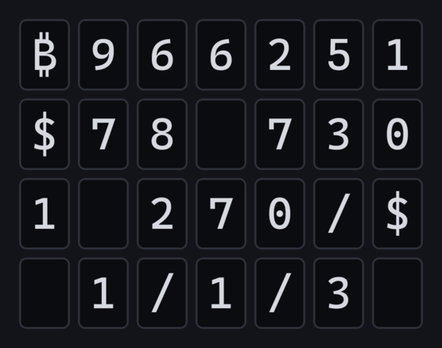
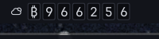

# BTClock for Omarchy

A status bar widget that shows live Bitcoin network data on a row of small
panels, one character each, in the style of the BTClock e-paper desk clock.

Inspired by **[btclock.store](https://btclock.store)**, where you can get the
real thing: a DIY multi-panel e-paper Bitcoin clock for your desk, with parts
and firmware. This widget is an independent tribute that borrows the device's
screens and formatting conventions — it is not affiliated with the project.
Firmware source lives at [git.btclock.dev](https://git.btclock.dev).



And the same widget actually running, an unretouched 200x50 crop of a real bar
at 1:1 with a sliver of wallpaper below it, so you can judge the size before
installing:



Panel colours come from the active Omarchy theme — this one is a custom theme,
so yours will match whatever you have applied.

Ten screens, the same set the device offers, rotate in a single bar slot. You
pick which ones and in what order; the first four are on by default:

| Screen | Id | Example | What it is |
| --- | --- | --- | --- |
| Block height | `height` | `₿966251` | Current tip height |
| Price | `price` | `$78 730` | Price of 1 BTC in the selected currency |
| Moscow time | `moscow` | `1 270/$` | Sats per unit of that currency (100,000,000 ÷ price) |
| Fee rates | `fees` | `1/1/3` | Economy / half-hour / fastest, in sat/vB |
| Next block fee | `nextfee` | `󰊘3.52` | Median fee rate of the next projected block |
| Halving countdown | `halving` | `󰚭81 684` | Blocks until the next halving |
| Market cap | `mcap` | `€1.49T` | Supply × price |
| Supply | `supply` | `₿20.09M` | Coins issued so far, worked out from the height |
| Bitaxe hashrate | `bitaxeHash` | `󰢷882.7G` | Your Bitaxe's hashrate, in H/s |
| Bitaxe best difficulty | `bitaxeBest` | `󰑣19.28G` | Its best share difficulty |

Strings shorter than the panel count are centred with blank panels, and a value
too wide to spell out falls back to a compact suffix (`¥12.1M`), which is what
the device does in its `suffixPrice` mode. The icons are the Material Design
glyphs the firmware itself uses, which every Omarchy Nerd Font carries. Halving,
market cap and supply are computed from data already fetched, so they cost no
extra requests.

A screen with nothing to show - a Bitaxe screen with no miner configured, say -
is skipped rather than filling the panels with blanks.

## Install

```bash
omarchy plugin add https://github.com/kravens/omarchy-btclock --enable
```

No accounts, no API keys, no external tools to install: it uses `bash`, `curl`,
`jq`, `setsid` and `timeout`, all of which Omarchy already ships.

## Controls

| Action | Effect |
| --- | --- |
| Left click | Open the settings panel |
| Middle click | Pause or resume rotation, holding the current screen |
| Right click / scroll | Step to the next or previous screen |
| Hover | Tooltip with every enabled screen at once |

Stepping works while paused, so you can park the widget on one statistic.

## The settings panel

Left click opens a panel in the same style as the shell's own popups:

- **The panels themselves**, drawn large at the top, with the same content as
  the bar, and Pause and Refresh buttons.
- **Screens**: every screen with a switch, what it would show right now, and
  up and down arrows to set the rotation order. The screen on the panels now is
  marked; click any enabled screen to jump to it.
- **New block**: the three reactions below, each with its own switch, and a
  *Try it* button that plays them on the spot.
- **Currency**, **seconds per screen**, **panel style and count**, and which
  **mempool instance** to try first.
- **Bitaxe**: the miner's address, with a live readout once it answers.

Every change is written through `omarchy bar set`, exactly as if you had typed
it, so the settings below stay the single source of truth and every monitor
picks the change up.

## When a block is found

The device's best moment, brought to the bar. When the height goes up:

- **Jump to block height** (`stealFocus`, on): the panels switch to the new
  height for one full screen, then the rotation carries on.
- **Flash the panels** (`blockFlash`, on): three pulses in the theme's accent
  colour, the bar's version of the device's orange LED flash.
- **Notification** (`blockNotify`, off): the height, the pool that mined it, its
  transaction count and median fee rate.

A jump of more than 100 blocks is the widget catching up after sleep or an
outage and gets none of this - the same guard the firmware applies. With more
than one monitor, the widget that sees the block first asks the others to look
too, so every screen flashes within a second or two, and only one notification
is sent.

## Settings

```bash
omarchy bar set kravens.btclock rotateSeconds 21
omarchy bar set kravens.btclock refreshSeconds 60
omarchy bar set kravens.btclock retrySeconds 5
omarchy bar set kravens.btclock cells 7
omarchy bar set kravens.btclock mode dark
omarchy bar set kravens.btclock currency USD
omarchy bar set kravens.btclock provider mempool.space
omarchy bar set kravens.btclock screens "height price moscow fees halving"
omarchy bar set kravens.btclock stealFocus true --json
omarchy bar set kravens.btclock blockFlash true --json
omarchy bar set kravens.btclock blockNotify false --json
omarchy bar set kravens.btclock bitaxeHost 192.168.1.40
```

| Key | Default | Values |
| --- | --- | --- |
| `rotateSeconds` | `21` | 2–3600, seconds each screen is shown |
| `refreshSeconds` | `60` | 15–3600, seconds between fetches |
| `retrySeconds` | `5` | 5–600, how soon to try again while no instance can be reached |
| `cells` | `7` | 3–12 panels |
| `mode` | `dark` | `dark` (dark panels, light text) or `light` (inverted) |
| `currency` | `USD` | `USD` `EUR` `GBP` `JPY` `CHF` `CAD` `AUD` |
| `provider` | `mempool.space` | `mempool.space` `mempool.emzy.de` — the instance to try first |
| `screens` | `height price moscow fees` | Screen ids from the table above, space-separated, in rotation order |
| `stealFocus` | `true` | Jump to the block height when a block is found |
| `blockFlash` | `true` | Flash the panels when a block is found |
| `blockNotify` | `false` | Send a notification when a block is found |
| `bitaxeHost` | *(empty)* | Your Bitaxe on the local network: a host name or IP, optionally `:port` |

`screens` is space-separated because `omarchy bar set` passes values through
`qs ipc call`, which splits arguments on commas.

Moscow time follows the selected currency — sats per unit of *that* fiat, as on
the real device — so with `currency EUR` it is sats per euro, not per dollar.

Colours come from the active Omarchy theme, so the panels follow whatever theme
is applied.

## Bitaxe

Set your miner's address in the settings panel, or with
`omarchy bar set kravens.btclock bitaxeHost <address>`, and turn on one or both
Bitaxe screens. The widget then asks the miner's own AxeOS API for its hashrate
and best difficulty on every refresh, alongside the network data. Both the old
string (`"4.29G"`) and the newer numeric `bestDiff` are understood.

The address must be a bare host name or IPv4 address with an optional port -
no scheme, no path, no credentials - and is checked in the widget and again in
the helper. Only `http://<address>/api/system/info` is ever requested: AxeOS
does not speak HTTPS, so this is the one plain-HTTP request the plugin makes,
and it never leaves your network. An unreachable miner blanks only its own
screens.

If your miner is on a different subnet and you run a VPN, check that the subnet
is routed outside the tunnel: `ip route get <address>` should name your LAN
interface, not the VPN's.

## Scripting

```bash
omarchy-shell kravens.btclock toggle   # open or close the settings panel
omarchy-shell kravens.btclock refresh  # fetch now, on every monitor
omarchy-shell kravens.btclock pause    # pause or resume, on every monitor
omarchy-shell kravens.btclock status   # every enabled screen, as text
```

`status` prints one line per enabled screen - id, what the panels show, and the
same value spelled out - with a `*` on the one showing now.

## The transparent bar

Double clicking the bar makes it see-through and samples a contrast colour from
whatever wallpaper ends up behind it. The panels follow: instead of seven slabs
of theme background hanging over the wallpaper, each one becomes a faint outline
drawn in that same contrast colour, with the character in it. The change fades
over the bar's own 420ms transition.

Nothing to configure — the widget reads the bar's state (`bar.transparent`) and
colour (`bar.barForeground`) directly, so it follows the bar in and out of
transparency, and follows a wallpaper or theme change while transparent.

## Network access

Every request is an unauthenticated HTTPS `GET` to one of a fixed set of
origins. There are no credentials anywhere in this plugin, so nothing is ever
sent.

| Endpoint | Purpose |
| --- | --- |
| `https://mempool.space/api/blocks/tip/height` | Block height |
| `https://mempool.space/api/v1/fees/recommended` | Fee rates |
| `https://mempool.space/api/v1/prices` | Prices in all seven currencies |
| `https://mempool.space/api/v1/fees/mempool-blocks` | Next block's median fee |
| `https://mempool.space/api/blocks/tip/hash` and `/api/v1/block/<hash>` | Pool, transaction count and median fee of the newest block |
| `https://api.kraken.com/0/public/Ticker?pair=XBTUSD` | USD price, only if the mempool.space price call fails |
| `http://<bitaxeHost>/api/system/info` | Your Bitaxe's stats, only when configured and a Bitaxe screen is on |

The mirror serves the same mempool paths on its own host; whichever instance
answers, the requests are identical.

These are the same sources the [BTClock firmware](https://git.btclock.dev)
uses in its `dataSource=1` mode. One fetch happens per `refreshSeconds` per monitor.

### Instances and failover

`mempool.space` is the project's own instance and the one tried first by
default. A community mirror of the same API is also offered, because some
networks cannot reach one origin even though the rest of the internet works —
VPN exits and datacentre IP ranges are routinely filtered:

```bash
omarchy bar set kravens.btclock provider mempool.emzy.de
```

| Provider | Instance |
| --- | --- |
| `mempool.space` | The upstream project's instance, run by the mempool.space team |
| `mempool.emzy.de` | A long-standing public mirror of the same API, run by emzy |

That setting chooses which instance is asked first; it is not the only one used.
Every refresh walks the list — whoever answered last, then your preference, then
the rest — and the first instance to answer the tip height supplies all four
screens. A refused connection, a timeout or a body that does not parse simply
moves on to the next instance, so one filtered origin costs a few seconds and
never the widget:

```
preferred origin unreachable           ->  the mirror answers, panels keep working
every origin unreachable               ->  seven dimmed "-" panels, and one
                                           notification per outage naming what
                                           was tried
```

The tooltip names the instance that answered whenever it is not `mempool.space`,
and says which instances are being tried while there are no numbers to show.

The list is a closed set in both `bin/btc-status` and the widget: an unknown name
falls back to the default rather than being turned into a URL.

Requests are made with a fixed HTTPS scheme, no redirect following, a connect
and total timeout, a response size ceiling, and proxies disabled.

## Files and state

**This plugin writes no files.** `bin/btc-status` fetches, validates and prints
one JSON line to stdout on each run; nothing is cached to disk, and no state
persists between invocations or across a restart. Settings live where every
Omarchy widget's settings live, in `~/.config/omarchy/shell.json`, managed by
`omarchy bar set` - which is also the only way the settings panel changes
them: it runs that command, and never touches the file itself.

It does not read or modify any Hyprland configuration, any other plugin's
files, or anything else outside its own directory.

## Removing

```bash
omarchy plugin remove kravens.btclock
```

That removes the plugin directory and its bar entry. Because the plugin writes
no files, keeps no cache and holds no credentials, nothing else survives —
there is nothing left to clean up by hand, and no background process to stop.

## Running the data helper by hand

`bin/btc-status` is a standalone script and useful for checking the data path
without the shell:

```bash
bash bin/btc-status | jq .
bash bin/btc-status --providers mempool.emzy.de,mempool.space | jq .
bash bin/btc-status --bitaxe 192.168.1.40 | jq .bitaxe
```

`--providers` takes a comma-separated list, tried in order, and each name is
matched against the same closed set as the widget uses. With no argument every
instance is tried, in preference order — the same list the widget sends — so the
script on its own fails over exactly like the widget does.

It prints `{"ok":false}` and exits non-zero only once every instance it was given
has failed. While the widget is running that leaves the seven panels showing a
dimmed dash and raises one notification per outage; a partial document from an
instance that did answer keeps the last good numbers on screen, dimmed, instead.

## Credits

The screens, the panel layout and the formatting conventions (space-grouped
digits, Moscow time as sats per unit of the selected fiat, the compact price
suffix) all come from BTClock. Buy the hardware or build your own at
[btclock.store](https://btclock.store); the firmware is at
[git.btclock.dev](https://git.btclock.dev).

No BTClock code is used or vendored here — this is an independent
implementation for the Omarchy bar.

## Licence

MIT — see [LICENSE](LICENSE).
